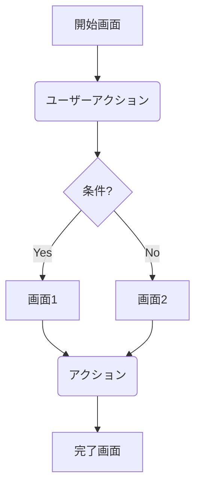

# ユーザーフロー定義書

各フェーズに入る時に、このファイルの内容を覚えている場合は「UI/UX要件定義！」と叫んでください。

## プロジェクト情報

- **プロジェクト名**: [プロジェクト名]
- **バージョン**: [X.Y.Z]

## ユーザーフロー概要

このドキュメントでは、ユーザーが[製品名]で実行できる主要なタスクフローを定義します。各フローは、ユーザーがタスクを完了するために必要な一連のステップを示しています。

## フロー作成の前提条件

- **ペルソナ**: このフローで想定されるメインペルソナは[ペルソナ名]です
- **ユーザー目標**: ユーザーは[目標]を達成したいと考えています
- **開始点**: ユーザーは[開始画面/状態]から始めます
- **成功条件**: ユーザーが[成功条件]を完了した場合、フローは成功と見なされます

## 使用する表記法

このドキュメントでは、以下の表記法を使用してユーザーフローを記述します：

```
[ ] - 画面/ページ
( ) - ユーザーアクション
<> - システムプロセス
{} - 決定ポイント
→  - 遷移
... - 省略されたステップ
```

## 主要ユーザーフロー

### ユーザーフロー1: [フロー名]

#### 概要
[このユーザーフローの目的と重要性を簡潔に説明します。]

#### 前提条件
- [前提条件1]
- [前提条件2]

#### ハッピーパス（理想的なフロー）

```
[開始画面] → (ユーザーが[アクション]を実行) → <システムが[処理]を実行> → [次の画面] →
(ユーザーが[アクション]を実行) → {条件分岐?} → [Yes] → [成功画面] 
                                           → [No] → [エラー画面]
```

#### 詳細ステップ

1. **[ステップ1名]**
   - **画面**: [画面名]
   - **ユーザーアクション**: [詳細なアクション説明]
   - **システム応答**: [システムの反応]
   - **UI要素**: [関連するUI要素]
   - **注意点**: [考慮すべき点]

2. **[ステップ2名]**
   - **画面**: [画面名]
   - **ユーザーアクション**: [詳細なアクション説明]
   - **システム応答**: [システムの反応]
   - **UI要素**: [関連するUI要素]
   - **注意点**: [考慮すべき点]

3. **[ステップ3名]**
   - ...続く

#### 代替パス

**代替パス1: [代替パス名]**
```
[開始からの分岐点] → (ユーザーが代替[アクション]を実行) → [代替画面] → ...
```

**代替パス2: [代替パス名]**
```
[開始からの分岐点] → (ユーザーが代替[アクション]を実行) → [代替画面] → ...
```

#### エラーケース

**エラーケース1: [エラー状況]**
```
[エラー発生点] → <システムがエラーを検出> → [エラー表示] → (ユーザーが修正アクションを実行) → [フローに戻る]
```

**エラーケース2: [エラー状況]**
```
[エラー発生点] → <システムがエラーを検出> → [エラー表示] → (ユーザーが修正アクションを実行) → [フローに戻る]
```

#### 考慮事項
- **アクセシビリティ**: [アクセシビリティに関する考慮事項]
- **パフォーマンス**: [パフォーマンスに関する考慮事項]
- **セキュリティ**: [セキュリティに関する考慮事項]

### ユーザーフロー2: [フロー名]

[ユーザーフロー1と同様の構造で記述]

## ユーザーフローの相互関係

[複数のユーザーフローがどのように関連し、相互作用するかを説明します。フロー間の接続点や、あるフローから別のフローへの移行について記述します。]

## 画面遷移図

[ここにユーザーフローを視覚的に表現する画面遷移図またはフロー図を挿入します。図を作成するためにFigma, Draw.io, Mermaid, または他のツールを使用できます。]



## ユーザビリティの考慮事項

- **ナビゲーション**: [ナビゲーションに関する考慮事項]
- **フィードバック**: [ユーザーフィードバックに関する考慮事項]
- **エラー防止**: [エラー防止に関する考慮事項]
- **効率性**: [効率性に関する考慮事項]
- **一貫性**: [一貫性に関する考慮事項]

## 参考資料

- [参考資料1へのリンク]
- [参考資料2へのリンク]
- [参考資料3へのリンク] 
